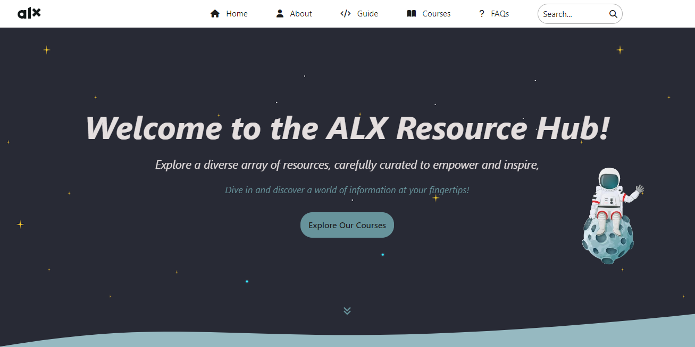
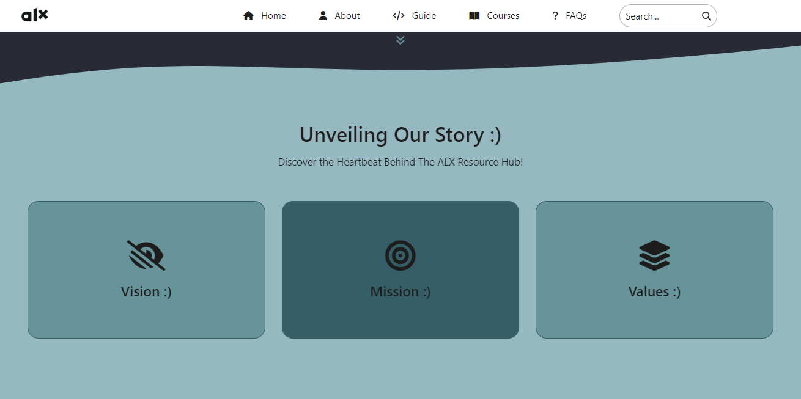

## ALX Resource Hub : A World Of Information At Your Fingertips!

## Table of contents

- [Overview](#overview)
- [Purpose](#purpose)
- [The Challenge](#the-challenge)
  - [Screenshot](#screenshot)
  - [Links](#links)
- [My process](#my-process)
  - [built with](#built-with)
- [Acknowledgements](#acknowledgements)
- [Conclusion](#conclusion)

## Overview
The ALX Resource Hub is a organized centralized platform designed to provide comprehensive resources and support to students, educators and professionals associated with the ALX program. The hub serves as a one stop shop for accessing educational materials, tools and information essential for learning and development within the ALX ecosystem.

## What is ALX?
ALX is an initiative under the African Leadership Group, which is dedicated to transfroming Africa by developing the continent's next generation of leaders. The program offers a variety of educational and professional training programs, focusing on areas such as software engineering, data science, business leadership and more. ALX aims to equip individuals with the skills and knowledge necessary to thrive in the modern, global economy.

## Purpose of the ALX Resource Hub
The ALX Resource Hub was created with several key objectives in mind:

- Centralization of resources through efficient access and organization (following the ALX SE Programme outline strictly).
- Enhanced learning experience through comprehensive materials and up-to-date content.
- Support and collaboration through community engagement and mentorship.
- Professional development.

## Why Was The ALX Resource Hub Created?

- Addressing the skills gap in status quo.
- Supporting Africa's development.
- Enhancing educational outcomes for ALX students.
- Promoting lifelong learning.
  

### The challenge

Users should be able to:

- View the optimal layout depending on their device's screen size.
- See interactive elements.
- Interact with backend through the FAQs section.

### Screenshot

### Links

- Live Site URL: [ALX Resource Hub](https://muhdal-amin.github.io/ALX-Resource-Hub/)

## My process

### Built with

- HTML5
- CSS3
- JavaScript
- Mocky (Backend simulation Mock API tool)

## Acknowledgements

To ALX - For giving me the wings to fly and watering my bare dreams!

[Muhdal-Amin](https://github.com/Muhdal-Amin)

[w3schools](https://w3schools..com)

## Conclusion

The ALX Resource Hub is a pivotal initiative designed to support the educational and professional development of individuals within the ALX community. It represents my commitment to giving back to a community that has placed the world of binaries and variables in my palms and a significant step towards creating a skilled, empowered workforce capable of driving Africa's future development.
